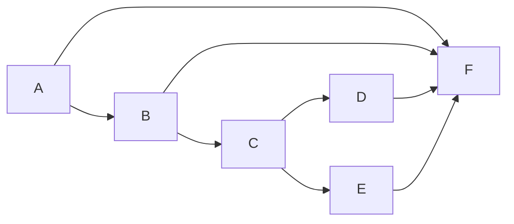

# 软件质量测试wordCount说明

### 项目github地址[wordCount](https://github.com/chenmo1996/wordCount/tree/master/test2)

### PSP表格

| **PSP2.1**                              | PSP阶段                                 | 预估耗时(分钟) | 实际耗时（分钟） |
| --------------------------------------- | --------------------------------------- | -------------- | ---------------- |
| Planning                                | 计划                                    | 10             | 10               |
| · Estimate                              | · 估计这个任务需要多少时间              | 5              | 5                |
| Development                             | 开发                                    | 10             | 5                |
| · Analysis                              | · 需求分析 (包括学习新技术)             | 30             | 20               |
| · Design Spec                           | · 生成设计文档                          | 10             | 0                |
| · Design Review                         | · 设计复审 (和同事审核设计文档)         | 10             | 0                |
| · Coding Standard                       | · 代码规范 (为目前的开发制定合适的规范) | 15             | 15               |
| · Design                                | · 具体设计                              | 60             | 20               |
| · Coding                                | · 具体编码                              | 60             | 40               |
| · Code Review                           | · 代码复审                              | 10             | 10               |
| · Test                                  | · 测试（自我测试，修改代码，提交修改）  | 60             | 40               |
| Reporting                               | 报告                                    | 30             | 20               |
| · Test Report                           | · 测试报告                              | 30             | 20               |
| · Size Measurement                      | · 计算工作量                            | 5              | 5                |
| · Postmortem & Process Improvement Plan | · 事后总结, 并提出过程改进计划          | 20             | 0                |
|                                         | 合计                                    | 250            | 200              |

### 接口实现

我负责输入模块和解析

### 程序设计实现

四个分步函数：


```java
import java.io.InputStream;
import java.util.*;
import java.util.regex.Matcher;
import java.util.regex.Pattern;

public class Counter {
    private HashMap<String, Integer> map;
    private PriorityQueue<String> queue;
    private InputStream is;
    private Scanner scanner;

    public Counter(InputStream is) {
        map = new HashMap<>();
        queue = new PriorityQueue<>(new Comparator<String>() {
            @Override
            public int compare(String o1, String o2) {
                int c1 = map.getOrDefault(o1, 0);
                int c2 = map.getOrDefault(o2, 0);
                return c1 - c2;
            }
        });
        this.is = is;
        scanner = new Scanner(is);
    }

    public void processCount() {
        Pattern pattern = Pattern.compile("[A-Za-z]+(-[A-Za-z]*)?");
        while (scanner.hasNextLine()) {
            String line = scanner.nextLine();
            Matcher matcher = pattern.matcher(line);

            while (matcher.find()) {
                String s = matcher.group();
                int count = map.getOrDefault(s, 0) + 1;
                map.put(s, count);
                if (queue.isEmpty()) {
                    queue.add(s);
                } else {
                    if (map.getOrDefault(s, 0) >= map.get(queue.peek())) {
                        if (queue.contains(s)) {
                            queue.remove(s);
                        }
                        queue.add(s);
                    }

                    if (queue.size() >= 100) {
                        queue.poll();
                    }
                }
            }
        }
    }

    public HashMap<String, Integer> getMap() {
        return map;
    }

    public PriorityQueue<String> getQueue() {
        return queue;
    }
}

```

一个主函数

```java
import java.io.BufferedInputStream;
import java.io.FileInputStream;
import java.io.FileNotFoundException;

public class Main {
    public static void main(String[] args) {
        if (args.length != 1) {
            throw new RuntimeException("program should take exactly 1 argument.");
        }

        if (!args[0].endsWith(".txt")) {
            throw new RuntimeException("invalid file format, should be txt");
        }

        BufferedInputStream bis = null;
        try {
            bis = new BufferedInputStream(new FileInputStream(args[0]));
        } catch (FileNotFoundException e) {
            System.err.println("File not found");
        }
        Counter counter = new Counter(System.in);
        counter.processCount();

        Output output = new Output(counter.getMap(), counter.getQueue());
        output.outputInfo(System.out);
    }
}
```


### 测试样例设计过程

### 测试原理  
根据白盒测试原理：

>白盒测试的测试方法有代码检查法、静态结构分析法、静态质量度量法、逻辑覆盖法、基本路径测试法、域测试、符号测试、路径覆盖和程序变异。
>白盒测试法的覆盖标准有逻辑覆盖、循环覆盖和基本路径测试。其中逻辑覆盖包括语句覆盖、判定覆盖、条件覆盖、判定/条件覆盖、条件组合覆盖和路径覆盖。六种覆盖标准发现错误的能力呈由弱到强的变化：
>1. 语句覆盖每条语句至少执行一次。
>2. 判定覆盖每个判定的每个分支至少执行一次。
>3. 条件覆盖每个判定的每个条件应取到各种可能的值。
>4. 判定/条件覆盖同时满足判定覆盖条件覆盖。
>5. 条件组合覆盖每个判定中各条件的每一种组合至少出现一次。
>6. 路径覆盖使程序中每一条可能的路径至少执行一次。


### 流程图

```flow
st=>start: 开始
cond=>condition: 程序有输入?
op=>operation: 获取输入内容
cond1=>condition: 输入第一项为.txt?
op1=>operation: Read(.txt)并返回结果
cond2=>condition: 返回结果?
op2=>operation: 写入result.txt
e=>end: 结束
st->cond->op->cond1->op1->cond2->op2->e
cond(yes)->op
cond(no)->e
cond1(yes)->op1
cond1(no)->e
cond2(yes)->op2
cond2(no)->e

```


### 白盒测试：四条路径



### 黑盒测试

对于输入，分为四个等价类

|                   | 工作路径 | 其他路径 |
| ----------------- | -------- | -------- |
| 存在的txt文件     | 等价类1  | 等价类2  |
| 存在的非txt文件   | 等价类3  | 等价类4  |
| 不存在的txt文件   | 等价类5  | 等价类6  |
| 不存在的非txt文件 | 等价类7  | 等价类8  |

### 具体测试脚本

```java
import org.jboss.arquillian.container.test.api.Deployment;
import org.jboss.arquillian.junit.Arquillian;
import org.jboss.shrinkwrap.api.ShrinkWrap;
import org.jboss.shrinkwrap.api.asset.EmptyAsset;
import org.jboss.shrinkwrap.api.spec.JavaArchive;
import org.junit.Test;
import org.junit.runner.RunWith;

import static org.junit.Assert.*;

public class CounterTest {


    @Test
    public void processCountTest1() {
        assertEquals(new Counter().processCount("input0.txt"), 50);
    }

    @Test
    public void processCountTest2() {
        assertEquals(new Counter().processCount("input1.txt"), 120);
    }

    @Test
    public void processCountTest3() {
        assertEquals(new Counter().processCount("input2.txt"), 65);
    }

    @Test
    public void processCountTest4() {
        assertEquals(new Counter().processCount("input3.txt"), 952);
    }

    @Test
    public void processCountTest5() {
        assertEquals(new Counter().processCount("input4.txt"), 355);
    }

    @Test
    public void processCountTest6() {
        assertEquals(new Counter().processCount("input5.txt"), 4550);
    }

    @Test
    public void processCountTest7() {
        assertEquals(new Counter().processCount("input6.txt"), 641);
    }

    @Test
    public void processCountTest8() {
        assertEquals(new Counter().processCount("input7.txt"), 5);
    }

    @Test
    public void processCountTest9() {
        assertEquals(new Counter().processCount("input8.txt"), 800);
    }

    @Test
    public void processCountTest10() {
        assertEquals(new Counter().processCount("input9.txt"), 3547);
    }
}
```

### 测试结果

